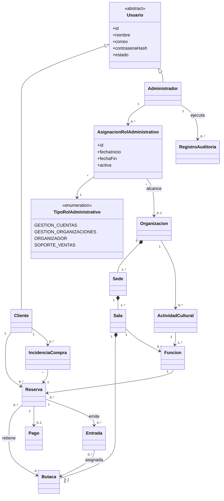

# EntreFunciones

## Especificación funcional de módulos clases y flujos

**Versión:** V1 candidata para aprobación del equipo  
**Fecha de actualización:** 13 de septiembre de 2026  
**Alcance:** plataforma web para publicar actividades culturales y vender entradas de organizaciones pequeñas con una o varias sedes.

---

## 1. Propósito del sistema

EntreFunciones conecta a organizaciones culturales con clientes que desean encontrar funciones y comprar entradas. La plataforma administra el catálogo, la disponibilidad comercial, la reserva temporal, el pago simulado y la emisión de entradas.

El flujo central es:

> Organización y sedes → actividad cultural y función → cartelera → reserva → pago simulado → entrada → soporte de compra y reporte comercial.

El sistema termina en la emisión y administración comercial de la entrada. La validación física del ingreso, la asistencia y los incidentes ocurridos durante el evento quedan fuera de EntreFunciones.

---

## 2. Límites del producto

### 2.1 Incluido

- Auto-registro de clientes.
- Inicio de sesión y recuperación de acceso.
- Mantenimiento de cuentas administrativas.
- Asignación de responsabilidades administrativas.
- Registro de organizaciones, sedes, salas y butacas.
- Registro de actividades culturales y programación de funciones.
- Cartelera pública y búsqueda.
- Aforo general y butacas numeradas.
- Reserva temporal con vencimiento.
- Pago simulado y emisión de entradas.
- Incidencias limitadas al proceso de compra.
- Reportes comerciales para cada organización.
- Auditoría de operaciones administrativas críticas.

### 2.2 Fuera del sistema

- Presentación y curaduría de propuestas culturales.
- Alquiler de salas.
- Recursos técnicos e inventario de equipamiento.
- Bloqueos de salas por mantenimiento.
- Guía cultural, recomendaciones automáticas, planes y favoritos.
- Validación de entradas en el acceso.
- Check-in y medición de asistencia.
- Incidencias ocurridas durante el evento.
- Pagos bancarios y devoluciones de dinero reales.
- Contabilidad, facturación tributaria y liquidación a organizaciones.

---

## 3. Actores y responsabilidades administrativas

| Actor | Descripción |
|---|---|
| Visitante | Persona no autenticada que consulta y filtra la cartelera. No constituye una clase persistente. |
| Cliente | Usuario que se registra públicamente, reserva, compra entradas y reporta problemas de sus compras. |
| Administrador | Usuario creado internamente cuyas operaciones dependen de las responsabilidades administrativas asignadas. |

### 3.1 Tipos de responsabilidad administrativa

`TipoRolAdministrativo` se implementa como un `enum`. Sus valores no son tipos de cuenta, actores independientes ni tablas separadas.

| Valor | Alcance | Funciones |
|---|---|---|
| `GESTION_CUENTAS` | Global | Mantener cuentas administrativas y de clientes; asignar y revocar responsabilidades. |
| `GESTION_ORGANIZACIONES` | Global | Registrar, verificar, activar y suspender organizaciones. |
| `ORGANIZADOR` | Una o varias organizaciones | Administrar todas las sedes, salas, butacas, actividades, funciones y reportes de las organizaciones asignadas. |
| `SOPORTE_VENTAS` | Global | Revisar pagos simulados y resolver incidencias de reservas, pagos o entradas. |

No existe el rol `SEGURIDAD`. La ciberseguridad, la protección de credenciales y la auditoría son requisitos transversales del sistema. `GESTION_CUENTAS` es la responsabilidad operativa para el mantenimiento de cuentas.

### 3.2 Decisiones para reducir el modelo

1. Solo existen dos tipos de cuenta: `Cliente` y `Administrador`.
2. `Usuario` es su clase base abstracta.
3. Un administrador puede recibir una o varias asignaciones.
4. `AsignacionRolAdministrativo` relaciona al administrador con un valor de `TipoRolAdministrativo`.
5. La organización es obligatoria cuando el tipo asignado es `ORGANIZADOR`.
6. No se crea una subclase ni una tabla por cada responsabilidad administrativa.
7. Si el equipo necesita mostrar los roles mediante herencia en Java, puede hacerlo sin alterar las demás clases y persistirlos en una sola estructura. Para el MVP se adopta el `enum` por ser la opción mínima.

---

## 4. Modelo mínimo de clases

El modelo contiene quince clases de dominio y doce `enum`. Las clases de consultas, filtros, resultados y reportes pueden implementarse como DTO u objetos temporales sin convertirse en entidades persistentes.

| Módulo propietario | Tipo | Responsabilidad |
|---|---|---|
| M1 | `Usuario` | Clase base abstracta con identidad, credenciales protegidas y estado de cuenta. |
| M1 | `Cliente` | Especialización de `Usuario` que compra entradas. |
| M1 | `Administrador` | Especialización de `Usuario` que recibe responsabilidades administrativas. |
| M1 | `TipoRolAdministrativo` | Enum con las cuatro responsabilidades administrativas. |
| M1 | `AsignacionRolAdministrativo` | Une administrador, tipo de rol y alcance organizacional opcional. |
| M1 | `RegistroAuditoria` | Registra actor, acción, fecha, entidad afectada y resultado. |
| M2 | `Organizacion` | Agrupa las sedes y delimita el alcance del organizador. |
| M2 | `Sede` | Ubicación física perteneciente a una organización. |
| M2 | `Sala` | Espacio de una sede con aforo máximo. |
| M2 | `Butaca` | Posición numerada dentro de una sala. |
| M3 | `ActividadCultural` | Contenido cultural ofrecido por una organización. |
| M3 | `Funcion` | Programación de una actividad en una sala, fecha y horario. |
| M5 | `Reserva` | Retención temporal de butacas o cupos. |
| M5 | `Pago` | Intento y resultado de pago simulado. |
| M5 | `Entrada` | Comprobante individual emitido después de confirmar el pago. |
| M6 | `IncidenciaCompra` | Caso de soporte vinculado con una reserva. |

### 4.1 Diagrama general

### 4.2 Persistencia mínima

El diagrama de clases no obliga a crear una tabla por cada clase o valor enumerado.

| Tabla mínima | Decisión |
|---|---|
| `usuario` | Conserva clientes y administradores mediante una columna `tipo_usuario`. No se requieren tablas separadas para las dos subclases. |
| `asignacion_rol_administrativo` | Conserva `administrador_id`, `tipo_rol` y `organizacion_id` opcional. |
| `registro_auditoria` | Conserva las acciones administrativas críticas. |
| `organizacion` | Información y estado de la organización. |
| `sede` | Pertenece a una organización. |
| `sala` | Pertenece a una sede. |
| `butaca` | Pertenece a una sala. |
| `actividad_cultural` | Pertenece a una organización. |
| `funcion` | Relaciona actividad cultural y sala. |
| `reserva` | Relaciona cliente y función y conserva cantidad, total, estado y vencimiento. |
| `reserva_butaca` | Tabla técnica de unión para las reservas con butacas numeradas; no requiere una clase de dominio propia. |
| `pago` | Pertenece a una reserva. |
| `entrada` | Se origina en una reserva y puede referirse a una butaca. |
| `incidencia_compra` | Pertenece a una reserva; desde ella se consultan el pago y las entradas asociados. |

No existen tablas separadas para los `enum`, `Cliente`, `Administrador`, filtros de cartelera ni reportes calculados.

### 4.3 Catálogo de enums

Los siguientes `enum` reúnen los estados y tipos utilizados por el modelo. No constituyen clases de dominio ni requieren tablas independientes.

| Módulo | Enum | Valores |
|---|---|---|
| M1 | `EstadoUsuario` | `ACTIVO`, `BLOQUEADO`, `DESACTIVADO` |
| M1 | `TipoRolAdministrativo` | `GESTION_CUENTAS`, `GESTION_ORGANIZACIONES`, `ORGANIZADOR`, `SOPORTE_VENTAS` |
| M2 | `EstadoOrganizacion` | `PENDIENTE_VERIFICACION`, `ACTIVA`, `SUSPENDIDA` |
| M3 | `TipoActividadCultural` | `PELICULA`, `OBRA_TEATRAL`, `CONCIERTO`, `CONFERENCIA`, `FERIA`, `EXPOSICION`, `OTRA` |
| M3 | `EstadoFuncion` | `BORRADOR`, `PUBLICADA`, `AGOTADA`, `CANCELADA` |
| M3 | `ModalidadAforo` | `NUMERADA`, `GENERAL` |
| M5 | `EstadoReserva` | `ACTIVA`, `CONFIRMADA`, `EXPIRADA`, `CANCELADA` |
| M5 | `EstadoPago` | `PENDIENTE`, `CONFIRMADO`, `RECHAZADO` |
| M5 | `EstadoEntrada` | `EMITIDA`, `ANULADA` |
| M6 | `TipoIncidenciaCompra` | `PAGO_NO_CONFIRMADO`, `PAGO_DUPLICADO`, `ENTRADA_NO_EMITIDA`, `ENTRADA_INCORRECTA`, `OTRO` |
| M6 | `EstadoIncidencia` | `ABIERTA`, `EN_REVISION`, `RESUELTA`, `RECHAZADA` |
| M6 | `TipoSolucionIncidencia` | `SIN_CAMBIO`, `PAGO_CONFIRMADO`, `ENTRADA_REEMITIDA`, `ENTRADA_ANULADA`, `DEVOLUCION_SIMULADA` |

---

## 5. Resumen de módulos

| Módulo | Nombre | RF | Clases propias |
|---|---|---:|---:|
| M1 | Gestión de cuentas roles y auditoría | 5 | 5 clases y 2 enums |
| M2 | Gestión de organizaciones sedes y salas | 4 | 4 clases y 1 enum |
| M3 | Gestión de actividades culturales y funciones | 4 | 2 clases y 3 enums |
| M4 | Cartelera y búsqueda de funciones | 4 | 0 |
| M5 | Reservas pagos y emisión de entradas | 7 | 3 clases y 3 enums |
| M6 | Soporte de ventas y reportes comerciales | 5 | 1 clase y 3 enums |
| **Total** |  | **29** | **15 clases y 12 enums** |

---

# Módulo 1 Gestión de cuentas roles y auditoría

## 1.1 Objetivo

Gestionar el registro de clientes, la autenticación, las cuentas administrativas, sus responsabilidades, alcances y auditoría.

## 1.2 Responsabilidades

- Crear clientes mediante el registro público.
- Iniciar y cerrar sesión.
- Recuperar el acceso a una cuenta.
- Mantener cuentas de clientes y administradores.
- Crear cuentas administrativas.
- Asignar y revocar responsabilidades administrativas.
- Aplicar el alcance organizacional.
- Registrar operaciones administrativas críticas.

## 1.3 Requisitos funcionales

| ID | Requisito | Prioridad |
|---|---|---|
| RF-M1-01 | El sistema debe permitir que un visitante registre una cuenta con nombre, correo y contraseña, creando exclusivamente una cuenta de tipo `Cliente`. | MVP |
| RF-M1-02 | El sistema debe permitir que clientes y administradores inicien y cierren sesión, y recuperen el acceso mediante su correo registrado. | MVP |
| RF-M1-03 | Un administrador con `GESTION_CUENTAS` debe poder buscar, bloquear, reactivar y desactivar cuentas de clientes y administradores. | MVP |
| RF-M1-04 | Un administrador con `GESTION_CUENTAS` debe poder crear cuentas administrativas y asignar o revocar sus responsabilidades. `ORGANIZADOR` debe vincularse con una organización. | MVP |
| RF-M1-05 | El sistema debe restringir las operaciones según el tipo y alcance de la asignación administrativa, y registrar en `RegistroAuditoria` los cambios de cuentas y responsabilidades. | MVP |

## 1.4 Clases propias

- `Usuario`
- `Cliente`
- `Administrador`
- `AsignacionRolAdministrativo`
- `RegistroAuditoria`
- `TipoRolAdministrativo` como enum

## 1.5 Reglas de negocio

1. El correo debe ser único entre las cuentas activas.
2. La contraseña se almacena mediante un mecanismo de protección; nunca como texto original.
3. El registro público crea solamente cuentas de `Cliente`.
4. Las cuentas de `Administrador` se crean internamente.
5. Un administrador puede tener varias asignaciones activas.
6. `ORGANIZADOR` requiere una organización como alcance.
7. Una cuenta bloqueada o desactivada no puede iniciar nuevas sesiones.
8. Cada operación debe comprobar el tipo de rol y su alcance.
9. Los cambios de cuenta o asignación deben quedar auditados.

## 1.6 Flujos principales

### Flujo M1-A Registro de cliente

1. El visitante ingresa nombre, correo y contraseña.
2. El sistema valida el formato y la unicidad del correo.
3. Crea una cuenta de tipo `Cliente`.
4. El cliente inicia sesión.

**Resultado:** cliente autenticado, sin responsabilidades administrativas.

### Flujo M1-B Mantenimiento de cuentas administrativas

1. Un administrador con `GESTION_CUENTAS` busca una cuenta o crea un administrador.
2. Selecciona una responsabilidad administrativa.
3. Si selecciona `ORGANIZADOR`, elige la organización correspondiente.
4. El sistema guarda `AsignacionRolAdministrativo`.
5. Registra al responsable, la fecha y el cambio en `RegistroAuditoria`.

**Resultado:** facultad administrativa asignada sin crear otro tipo de usuario.

---

# Módulo 2 Gestión de organizaciones sedes y salas

## 2.1 Objetivo

Registrar y mantener organizaciones, sedes, salas y mapas de butacas, respetando el alcance de cada organizador.

## 2.2 Responsabilidades

- Registrar, verificar, activar y suspender organizaciones.
- Mantener la información de las organizaciones.
- Registrar y desactivar sedes.
- Registrar salas y su aforo máximo.
- Configurar butacas numeradas.
- Restringir cada cambio a la organización autorizada.

## 2.3 Requisitos funcionales

| ID | Requisito | Prioridad |
|---|---|---|
| RF-M2-01 | Un administrador con `GESTION_ORGANIZACIONES` debe poder registrar, verificar, activar, suspender y consultar organizaciones. | MVP |
| RF-M2-02 | Un administrador con `ORGANIZADOR` debe poder consultar y modificar únicamente las organizaciones que tenga asignadas. | MVP |
| RF-M2-03 | El organizador debe poder registrar, modificar y desactivar las sedes y salas de su organización, indicando dirección, nombre y aforo máximo. | MVP |
| RF-M2-04 | El organizador debe poder configurar las butacas de una sala indicando código, fila y número, sin permitir identificadores repetidos dentro de esa sala. | MVP |

## 2.4 Clases propias

- `Organizacion`
- `Sede`
- `Sala`
- `Butaca`

## 2.5 Reglas de negocio

1. Una organización puede tener varias sedes.
2. Una sede pertenece a una sola organización.
3. Una sala pertenece a una sola sede.
4. El aforo máximo de una sala debe ser positivo.
5. Una butaca pertenece a una sala.
6. El código de butaca es único dentro de la sala.
7. `ORGANIZADOR` controla todas las sedes de las organizaciones indicadas en sus asignaciones.
8. La desactivación no elimina el historial.
9. Este módulo no administra recursos técnicos, alquileres ni bloqueos de disponibilidad.

## 2.6 Flujo principal

### Flujo M2-A Configuración de una organización

1. `GESTION_ORGANIZACIONES` registra y habilita la organización.
2. `GESTION_CUENTAS` asigna `ORGANIZADOR` a un administrador y establece su alcance.
3. El organizador registra una sede.
4. Registra sus salas y el aforo máximo.
5. Si la sala utiliza asientos numerados, configura las butacas.

**Resultado:** infraestructura disponible para programar funciones.

---

# Módulo 3 Gestión de actividades culturales y funciones

## 3.1 Objetivo

Registrar actividades culturales y programar sus funciones con sala, horario, precio, modalidad y aforo.

## 3.2 Responsabilidades

- Mantener las actividades culturales de cada organización.
- Programar funciones.
- Verificar cruces de horario en una sala.
- Verificar el aforo.
- Publicar y cancelar funciones.

## 3.3 Requisitos funcionales

| ID | Requisito | Prioridad |
|---|---|---|
| RF-M3-01 | El organizador debe poder registrar y modificar actividades culturales indicando título, descripción y tipo de actividad. | MVP |
| RF-M3-02 | El organizador debe poder programar funciones indicando sala, fecha, horario, precio, aforo de venta y modalidad de aforo. | MVP |
| RF-M3-03 | Antes de registrar una función, el sistema debe validar que no exista otra función en la misma sala durante un horario superpuesto y que el aforo de venta no supere el aforo máximo. | MVP |
| RF-M3-04 | El organizador debe poder publicar o cancelar una función. Solamente las funciones publicadas deben aparecer en la cartelera. | MVP |

## 3.4 Clases propias

- `ActividadCultural`
- `Funcion`

El tipo de actividad se representa como un atributo enumerado de `ActividadCultural`. Una película o una obra teatral no necesita una subclase independiente.

## 3.5 Estados y tipos

**Tipo de actividad:** `PELICULA`, `OBRA_TEATRAL`, `CONCIERTO`, `CONFERENCIA`, `FERIA`, `EXPOSICION`, `OTRA`.  
**Estado de función:** `BORRADOR`, `PUBLICADA`, `AGOTADA`, `CANCELADA`.  
**Modalidad de aforo:** `NUMERADA`, `GENERAL`.

Estos valores corresponden a los `enum` del catálogo y no requieren entidades persistentes.

## 3.6 Reglas de negocio

1. Una actividad cultural pertenece a una organización.
2. Una actividad puede tener varias funciones.
3. Una función pertenece a una actividad y a una sala.
4. Dos funciones no pueden superponerse en la misma sala.
5. El aforo de venta no puede superar el aforo máximo de la sala.
6. Una función numerada utiliza las butacas configuradas para la sala.
7. Una función general vende cantidades de cupos sin asignar butaca.
8. Solo el organizador de la organización propietaria puede modificar la actividad o función.

## 3.7 Flujo principal

### Flujo M3-A Programación de una función

1. El organizador registra o selecciona una actividad cultural.
2. Selecciona sala, fecha y horario.
3. Define precio, aforo de venta y modalidad.
4. El sistema valida horario y capacidad.
5. El organizador guarda y publica la función.

**Resultado:** función disponible para la cartelera.

---

# Módulo 4 Cartelera y búsqueda de funciones

## 4.1 Objetivo

Permitir al público consultar, buscar y revisar funciones publicadas antes de iniciar una reserva.

## 4.2 Responsabilidades

- Mostrar funciones publicadas.
- Buscar y filtrar.
- Mostrar el detalle de cada función.
- Mostrar disponibilidad actualizada.
- Revalidar precio y disponibilidad antes de reservar.
- Solicitar autenticación al iniciar una compra.

## 4.3 Requisitos funcionales

| ID | Requisito | Prioridad |
|---|---|---|
| RF-M4-01 | El sistema debe permitir que cualquier visitante consulte las funciones publicadas sin iniciar sesión. | MVP |
| RF-M4-02 | El visitante debe poder buscar y filtrar funciones por fecha, organización, sede, tipo de actividad y precio. | MVP |
| RF-M4-03 | El sistema debe mostrar el detalle de una función, incluyendo actividad, sede, sala, horario, precio, modalidad de aforo y disponibilidad actualizada. | MVP |
| RF-M4-04 | Al iniciar una reserva, el sistema debe comprobar nuevamente el precio y la disponibilidad y solicitar el inicio de sesión cuando el visitante todavía no esté autenticado. | MVP |

## 4.4 Clases propias

Este módulo no introduce clases persistentes. Consulta `ActividadCultural`, `Funcion`, `Organizacion`, `Sede` y `Sala`. Los filtros y resultados pueden representarse con DTO.

## 4.5 Reglas de negocio

1. Solo se muestran funciones publicadas o agotadas.
2. Una función agotada puede mostrarse, pero no ofrecerse para compra.
3. La disponibilidad mostrada es informativa hasta que M5 crea la reserva.
4. Una función cancelada debe desaparecer de la oferta comprable.
5. El visitante puede consultar sin cuenta.
6. Para reservar se requiere una cuenta de `Cliente`.
7. El MVP no incluye favoritos, planes ni recomendaciones automáticas.

## 4.6 Flujo principal

### Flujo M4-A Consulta de cartelera

1. El visitante abre la cartelera.
2. Filtra las funciones.
3. Abre el detalle de una función.
4. El sistema muestra precio, ubicación y disponibilidad.
5. El visitante selecciona comprar.
6. El sistema revalida la información.
7. Si no existe sesión, solicita iniciar sesión.
8. Transfiere la función seleccionada a M5.

---

# Módulo 5 Reservas pagos y emisión de entradas

## 5.1 Objetivo

Gestionar la reserva temporal de butacas o cupos, el pago simulado y la emisión de entradas sin sobreventa.

## 5.2 Responsabilidades

- Seleccionar butacas o cantidades.
- Crear reservas temporales.
- Liberar disponibilidad al vencer.
- Registrar pagos simulados.
- Confirmar o rechazar códigos de pago.
- Emitir entradas únicas.
- Mostrar al cliente su historial de compras.
- Impedir sobreventa y duplicación.

## 5.3 Requisitos funcionales

| ID | Requisito | Prioridad |
|---|---|---|
| RF-M5-01 | Un cliente autenticado debe poder seleccionar butacas específicas en una función numerada o indicar una cantidad de entradas en una función de aforo general. | MVP |
| RF-M5-02 | El sistema debe crear una `Reserva` temporal con fecha de expiración y retener las butacas o cupos seleccionados durante ese periodo. | MVP |
| RF-M5-03 | Cuando una reserva expire, se cancele o no complete el pago, el sistema debe liberar automáticamente sus butacas o cupos. | MVP |
| RF-M5-04 | El sistema debe generar un código de pago simulado y registrar el resultado del intento. Un administrador con `SOPORTE_VENTAS` debe poder confirmar o rechazar el código registrado. | MVP |
| RF-M5-05 | Después de confirmar el pago, el sistema debe confirmar la reserva y emitir una entrada con código único por cada cupo comprado, asociándola con una butaca cuando corresponda. | MVP |
| RF-M5-06 | El sistema debe impedir que una misma confirmación genere entradas duplicadas y evitar que las reservas activas y entradas emitidas superen el aforo de la función. | MVP |
| RF-M5-07 | El cliente debe poder consultar el estado de sus reservas, pagos y entradas emitidas. | MVP |

## 5.4 Clases propias

- `Reserva`
- `Pago`
- `Entrada`

No se requieren `InventarioAforo`, `Orden`, `DetalleOrden`, `PoliticaCancelacion` ni `Reembolso` como clases separadas. La información mínima de cantidad, precio, total y estado permanece en `Reserva` y `Pago`.

## 5.5 Estados

**Reserva:** `ACTIVA`, `CONFIRMADA`, `EXPIRADA`, `CANCELADA`.  
**Pago:** `PENDIENTE`, `CONFIRMADO`, `RECHAZADO`.  
**Entrada:** `EMITIDA`, `ANULADA`.

## 5.6 Reglas de negocio

1. En una función numerada, la reserva retiene butacas.
2. En una función general, la reserva retiene una cantidad de cupos.
3. La retención pertenece a `Reserva`, no a `Entrada`.
4. La reserva activa reduce temporalmente la disponibilidad.
5. Al expirar, cancelar o fallar el pago, la disponibilidad se libera.
6. Una entrada solo se emite después de confirmar el pago.
7. Una entrada se asocia con una butaca únicamente en modalidad numerada.
8. La confirmación del pago debe ser idempotente.
9. Las reservas activas y entradas emitidas no pueden superar el aforo.
10. EntreFunciones no almacena datos bancarios reales.

## 5.7 Flujos principales

### Flujo M5-A Compra con butacas numeradas

1. El cliente selecciona una o varias butacas.
2. El sistema comprueba su disponibilidad.
3. Crea una reserva temporal y muestra el vencimiento.
4. Genera un código de pago simulado.
5. `SOPORTE_VENTAS` confirma o rechaza el código.
6. Si se confirma, el sistema confirma la reserva.
7. Emite una entrada por cada butaca.

### Flujo M5-B Compra de aforo general

1. El cliente indica la cantidad de entradas.
2. El sistema verifica que existan suficientes cupos.
3. Crea una reserva temporal por la cantidad.
4. Ejecuta el mismo flujo de pago simulado.
5. Emite una entrada por cada cupo confirmado, sin asociar butacas.

### Flujo M5-C Reserva expirada o pago rechazado

1. Vence la reserva o se rechaza el pago.
2. La reserva cambia a `EXPIRADA` o `CANCELADA`.
3. El sistema libera las butacas o cupos.
4. No emite entradas.

---

# Módulo 6 Soporte de ventas y reportes comerciales

## 6.1 Objetivo

Atender incidencias ocurridas dentro del proceso de compra y generar reportes comerciales, sin administrar el acceso ni la asistencia al evento.

## 6.2 Responsabilidades

- Recibir problemas reportados desde el historial de compra.
- Revisar la reserva, el pago y las entradas relacionadas.
- Asignar y resolver incidencias.
- Reemitir o anular entradas cuando exista un error de plataforma.
- Registrar devoluciones simuladas.
- Auditar correcciones manuales.
- Mostrar reportes comerciales al organizador.

## 6.3 Requisitos funcionales

| ID | Requisito | Prioridad |
|---|---|---|
| RF-M6-01 | El cliente debe poder reportar una incidencia relacionada con una reserva, pago o entrada desde su historial de compras. La incidencia debe quedar vinculada con la reserva. | MVP |
| RF-M6-02 | Un administrador con `SOPORTE_VENTAS` debe poder consultar las incidencias, asignarse como responsable, cambiar su estado y registrar su resolución. | MVP |
| RF-M6-03 | Cuando se compruebe un error de la plataforma, `SOPORTE_VENTAS` debe poder reemitir una entrada, anular una entrada incorrecta o registrar una devolución simulada. | MVP |
| RF-M6-04 | El sistema debe registrar en la auditoría las confirmaciones manuales de pagos, anulaciones, reemisiones y devoluciones simuladas. | MVP |
| RF-M6-05 | El organizador debe poder consultar reportes de entradas vendidas, ingresos y ocupación comercial de sus organizaciones, filtrados por sede, función y periodo. | MVP |

## 6.4 Clase propia

- `IncidenciaCompra`

Los reportes son consultas o DTO calculados; no requieren las clases `HechoVenta`, `HechoAsistencia`, `Indicador`, `SolicitudReporte` ni `ReporteGenerado`.

## 6.5 Estados

**Tipo de incidencia:** `PAGO_NO_CONFIRMADO`, `PAGO_DUPLICADO`, `ENTRADA_NO_EMITIDA`, `ENTRADA_INCORRECTA`, `OTRO`.  
**Estado de incidencia:** `ABIERTA`, `EN_REVISION`, `RESUELTA`, `RECHAZADA`.  
**Tipo de solución:** `SIN_CAMBIO`, `PAGO_CONFIRMADO`, `ENTRADA_REEMITIDA`, `ENTRADA_ANULADA`, `DEVOLUCION_SIMULADA`.

## 6.6 Reglas de negocio

1. La incidencia se vincula con una reserva.
2. Desde la reserva se consultan el pago y las entradas relacionadas.
3. El cliente solo puede reportar problemas de sus propias compras.
4. `SOPORTE_VENTAS` es la única responsabilidad que permite ejecutar correcciones comerciales.
5. Toda corrección manual debe registrar responsable, fecha, motivo y resultado.
6. La devolución es simulada y no ejecuta una transferencia bancaria.
7. El organizador consulta únicamente sus organizaciones asignadas.
8. Los reportes utilizan pagos confirmados y entradas emitidas.
9. No se registran check-in, asistencia ni incidentes del evento.

## 6.7 Flujos principales

### Flujo M6-A Atención de una incidencia

1. El cliente abre una reserva desde su historial.
2. Selecciona reportar un problema y registra su descripción.
3. El sistema crea `IncidenciaCompra`.
4. `SOPORTE_VENTAS` revisa la reserva, el pago y las entradas.
5. Registra la solución.
6. Si corresponde, confirma el pago, reemite o anula una entrada, o registra una devolución simulada.
7. El sistema audita la acción y comunica el resultado.

### Flujo M6-B Reporte comercial

1. El organizador selecciona organización, periodo, sede o función.
2. El sistema valida su asignación.
3. Calcula entradas vendidas, ingresos confirmados y ocupación comercial.
4. Muestra el resultado.

---

# 6. Interfaces mínimas

Cada módulo expone una sola interfaz de servicio. Estas seis interfaces delimitan las responsabilidades sin crear una interfaz por clase, entidad, estado u operación. Los nombres de las operaciones son orientativos y no imponen una tecnología de comunicación.

| Módulo | Interfaz | Operaciones agrupadas |
|---|---|---|
| M1 | `IGestionCuentasService` | Registrar cliente; autenticar; recuperar acceso; mantener cuentas administrativas; asignar responsabilidades; consultar autorización; registrar auditoría. |
| M2 | `IGestionOrganizacionesService` | Mantener organizaciones, sedes, salas y butacas; consultar espacios configurados. |
| M3 | `IGestionProgramacionService` | Mantener actividades culturales; programar, validar, publicar y cancelar funciones. |
| M4 | `ICarteleraService` | Consultar, buscar, filtrar y mostrar el detalle y disponibilidad de funciones publicadas. |
| M5 | `IGestionVentasService` | Crear y vencer reservas; registrar y validar pagos simulados; emitir, consultar y anular entradas. |
| M6 | `ISoporteVentasService` | Registrar y resolver incidencias de compra; aplicar correcciones permitidas; consultar reportes comerciales. |

Las interfaces son elementos de diseño. No se almacenan en la base de datos ni aumentan el número de entidades persistentes.

---

# 7. Viajes completos

## 7.1 Incorporación de una organización

1. `GESTION_ORGANIZACIONES` registra y verifica la organización.
2. `GESTION_CUENTAS` crea o selecciona una cuenta de administrador.
3. Le asigna `ORGANIZADOR` con alcance sobre esa organización.
4. El organizador registra todas sus sedes, salas y butacas.

**Módulos:** M1 → M2.

## 7.2 De actividad cultural a cartelera

1. El organizador registra la actividad cultural.
2. Programa una función en una sala.
3. El sistema valida horario y aforo.
4. El organizador publica la función.
5. La función aparece en la cartelera.

**Módulos:** M2 → M3 → M4.

## 7.3 De la cartelera a la entrada

1. El visitante encuentra una función.
2. Inicia sesión como cliente.
3. Selecciona butacas o cantidad.
4. El sistema crea una reserva temporal.
5. Se confirma el pago simulado.
6. El sistema emite las entradas.

**Módulos:** M4 → M1 → M5.

## 7.4 De una compra con error a su resolución

1. El cliente reporta el problema desde su reserva.
2. `SOPORTE_VENTAS` revisa el pago y las entradas.
3. Registra la solución permitida.
4. El sistema actualiza la compra y audita la corrección.

**Módulos:** M5 → M6 → M1.

---

# 8. Matriz de permisos

| Operación | Visitante | Cliente | GESTION CUENTAS | GESTION ORGANIZACIONES | ORGANIZADOR | SOPORTE VENTAS |
|---|:---:|:---:|:---:|:---:|:---:|:---:|
| Consultar cartelera | Sí | Sí | Sí | Sí | Sí | Sí |
| Reservar y comprar | No | Sí | No | No | No | No |
| Consultar compras propias | No | Sí | No | No | No | No |
| Reportar incidencia propia | No | Sí | No | No | No | No |
| Mantener cuentas | No | No | Sí | No | No | No |
| Asignar responsabilidades | No | No | Sí | No | No | No |
| Registrar y suspender organizaciones | No | No | No | Sí | No | No |
| Mantener sedes y salas | No | No | No | No | Solo asignadas | No |
| Mantener actividades y funciones | No | No | No | No | Solo asignadas | No |
| Consultar reportes comerciales | No | No | No | No | Solo asignadas | No |
| Confirmar pagos simulados | No | No | No | No | No | Sí |
| Resolver incidencias de compra | No | No | No | No | No | Sí |

Una misma cuenta de `Administrador` puede tener más de una responsabilidad. La matriz expresa permisos, no tipos adicionales de usuario.

---

# 9. Requisitos no funcionales

| Código | Nombre | ISO/IEC 25010 | Descripción | Prioridad |
|---|---|---|---|---|
| RNF-INT-01 | Interoperabilidad frontend–backend | Compatibilidad — interoperabilidad | El frontend deberá comunicarse con el backend, aun cuando ambos sean sistemas heterogéneos, garantizando el intercambio correcto y completo de la información requerida por las funciones del sistema. | Alta |
| RNF-SEG-01 | Seguridad y trazabilidad | Seguridad — confidencialidad, integridad y responsabilidad | El sistema deberá restringir el acceso a las funciones y datos según el rol del usuario, proteger las credenciales y la información personal, y registrar el usuario, la fecha, la hora y la acción realizada en las operaciones críticas. El sistema no deberá almacenar números de tarjeta completos, el código de seguridad (CVV) ni otros datos sensibles del método de pago. | Alta |
| RNF-CON-01 | Consistencia de transacciones | Fiabilidad — prevención de fallos | El sistema deberá mantener la consistencia de las reservas y pagos cuando se realicen operaciones simultáneas o se interrumpa una operación, evitando duplicidades y garantizando que las entradas confirmadas nunca superen el aforo de la sala. | Alta |
| RNF-MNT-01 | Mantenibilidad y modularidad | Mantenibilidad — modularidad y capacidad de prueba | Los módulos deberán tener responsabilidades e interfaces delimitadas, de manera que una modificación interna en un módulo no requiera cambios en los demás, excepto cuando cambie una comunicación documentada. Cada regla de negocio crítica deberá contar con al menos una prueba automatizada. | Alta |
| RNF-REN-01 | Rendimiento de operaciones críticas | Eficiencia de desempeño — comportamiento temporal | Las consultas de cartelera y las reservas de entradas, incluida la validación del aforo, deberán completarse en un máximo de tres segundos para al menos el 95 % de las solicitudes durante las pruebas de carga definidas para el proyecto. | Alta |
| RNF-ADA-01 | Compatibilidad y adaptabilidad | Flexibilidad — adaptabilidad | Las funciones críticas deberán visualizarse y ejecutarse correctamente en las últimas tres versiones estables de Chrome, Firefox, Edge y Safari. La cartelera y el flujo de reserva deberán adaptarse a pantallas móviles sin presentar desplazamiento horizontal. | Media |
| RNF-DIS-01 | Disponibilidad y mantenimiento | Fiabilidad — disponibilidad | Las funciones de cartelera, solicitudes, validación de pagos y reserva de entradas deberán mantener una disponibilidad mensual mínima del 99.5 %. Los mantenimientos que interrumpan el servicio deberán realizarse entre las 00:00 y las 06:00, durar como máximo dos horas y comunicarse con 24 horas de anticipación. | Alta |
| RNF-REC-01 | Recuperación ante fallos | Fiabilidad — recuperabilidad | Ante una interrupción, el sistema deberá restablecer sus funciones en un plazo máximo de una hora y la pérdida de transacciones confirmadas no deberá superar los 15 minutos anteriores al fallo. | Alta |

---

# 10. Repartición y complejidad

| Módulo | Complejidad | Reto principal |
|---|---|---|
| M1 Gestión de cuentas roles y auditoría | Media | Autorización por responsabilidad y alcance. |
| M2 Gestión de organizaciones sedes y salas | Media | Jerarquía organización sede sala butaca. |
| M3 Actividades culturales y funciones | Media | Horarios, modalidad y aforo. |
| M4 Cartelera y búsqueda | Baja | Consultas y filtros sobre funciones publicadas. |
| M5 Reservas pagos y entradas | Alta | Vencimiento, concurrencia e idempotencia. |
| M6 Soporte de ventas y reportes | Media | Correcciones auditadas y límites de alcance. |

Cada integrante puede desarrollar un módulo. Las interfaces, los estados compartidos y las reglas de autorización deben acordarse antes de integrar las ramas.

---

# 11. Resumen de decisiones

- Se conserva `Usuario` con las hijas `Cliente` y `Administrador`.
- Las responsabilidades administrativas se compactan en `TipoRolAdministrativo`.
- No se crean subclases ni tablas por cada rol.
- El catálogo centraliza doce `enum` sin convertirlos en entidades persistentes.
- Cada módulo expone una sola interfaz de servicio, para un total de seis interfaces.
- `ORGANIZADOR` administra todas las sedes de las organizaciones asignadas.
- No existe `GestorSede`.
- No existen `Recurso` ni `BloqueoDisponibilidad`.
- `ActividadCultural` representa el contenido y `Funcion` su programación.
- La reserva retiene la butaca o el cupo; la entrada se emite después del pago.
- `IncidenciaCompra` se limita a la venta y se vincula con `Reserva`.
- El sistema no administra el acceso ni lo que ocurre durante el evento.
